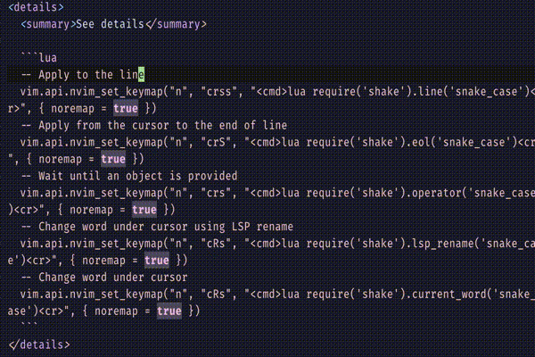
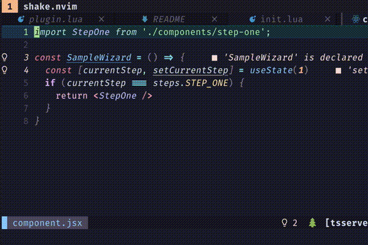
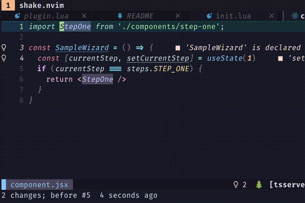

# Shake.nvim

Given a **LUA** function for **trasforming strings**, this module allows to apply that functions in several ways, like vim operators, apply the function on the current word, doing bulk replacement or in [LuaSnip](https://github.com/L3MON4D3/LuaSnip)pets

## Features

- [Functions as vim operator](#operator)
  - Pending mode operator
  - LSP replacement
- [Bulk replacement](#bulk-replacement)
  - Current buffer and visual selection
- [Built-in functions](#built-in-string-transforms)
  - String case: Camel, Pascal, Constant...
- Integration with other plugins
  - LSP
  - [Snip Lua](#snip-lua)
  - TODO: Telescope

## Usage examples

### Example #1: Apply a method on a string object

In the following code, the method `toggle_boolean` changes the string from "true" to "false" and the other way around

Let's register the method and assign its keybinding to `current_word`. This keybinding is repeatable (using `.`), usable inside macros and applies on a word object (`aw`) by default. We could also setup other keybindings to operate on the whole line, until end of line, a custom object or even the current word, but modifying it using Language Server Protocol (LSP)

For the function `toggle_boolean`, features like LSP rename does not make a lot of sense, let's use only current word change

```lua
local shake = require('shake')
local toggle_boolean = shake.utils.create_wrapped_method('toggle_boolean', function(str)
  local trim_info, trimmed_str = shake.utils.trim_str(str)
  local result = trimmed_str
  if trimmed_str == 'true' then
    result = 'false'
  elseif trimmed_str == 'false' then
    result = 'true'
  end
  return shake.utils.untrim_str(result, trim_info)
end)

shake.register_keybindings(toggle_boolean, {current_word = 'df'})
```



### Example #2: Given a string represented with several variants, replace it with another string keeping the variant form

Let's say you want to replace the `StepOne` component name to `StudentsOnboarding` in the following piece of code, run a bulk replacement custom command, like:

```lua
:Subs/step one/students onboarding<enter>
```



Or even specify the visual block



Consult the bulk replacement section for implementation details

### Example 3: Using SnipLua integration

The built-in methods can be used with other plugins, in the following example, a enum value is added (in TypeScript) in its both variants, camel case and constant case.

There are some utility functions to ease such task

## Setup

### Requirements

* Tested on [Neovim](https://neovim.io/) 0.6+

With packer.nvim

```lua
use {
  'johmsalas/shake.nvim',
  config = function()
    local shake = require('shake')

    -- keys order: 'line', 'eol', 'visual', 'operator', 'lsp_rename'
    shake.register_keys(shake.api.to_constant_case, {'crnn', 'crN', 'crn', 'crn', 'cRn'})
    shake.register_keys(shake.api.to_camel_case, {'crcc', 'crC', 'crc', 'crc', 'cRc'})
    shake.register_keys(shake.api.to_dash_case, {'crdd', 'crD', 'crd', 'crd', 'cRd'})

    shake.register_replace_command('Subs', {
      shake.api.to_upper_case,
      shake.api.to_lower_case,
      shake.api.to_snake_case,
      shake.api.to_dash_case,
      shake.api.to_constant_case,
      shake.api.to_dot_case,
      shake.api.to_phrase_case,
      shake.api.to_camel_case,
      shake.api.to_pascal_case,
      shake.api.to_title_case,
      shake.api.to_path_case,
    })

    lvim.builtin.which_key.mappings["r"]["s"] = { ":lua require('shake').replace_word_under_cursor('Subs')<cr>", "Replace word under cursor" }
  end
}
```

## Usage

### Operator

Add LUA functions as custom repeatable vim operators. Using `shake.nvim` you get:

- Custom key binding to apply the function on:
  - Current line
  - Until end of line
  - Given a vim object, like `aw` or `p`
  - The current word, using **LSP rename**. Affecting the definition and its references

Suppose constant, camel and dash cases were setup using the following code

```lua
-- keys order: 'line', 'eol', 'visual', 'operator', 'lsp_rename'
shake.register_keys(shake.api.to_constant_case, {'crnn', 'crN', 'crn', 'crn', 'cRn'})
shake.register_keys(shake.api.to_camel_case, {'crcc', 'crC', 'crc', 'crc', 'cRc'})
shake.register_keys(shake.api.to_dash_case, {'crdd', 'crD', 'crd', 'crd', 'cRd'})
```

Or using the shortcut, which is linewise less readable, but easier to read when many functions are registered in the same block

```lua
-- keys order: 'line', 'eol', 'visual', 'operator', 'lsp_rename'
shake.register_keys(shake.api.to_constant_case, {'crnn', 'crN', 'crn', 'crn', 'cRn'})
```

The following examples are based on the shown configuration

**Convert whole line**

`crnn`

**Convert until end of line**

`crN`

**Convert visual selection**

Given the current vim mode is `visual`, use `crn`

**LSP**

It is possible to change the case, not only of the word under the cursor, but its definition and usages via LSP. 
Hovering the text to change, use `cRn`

### Bulk replacement

Given two pieces of text A and B, it searches for all of A variants (in different string cases or custom functions), and replaces the text using B. It transforms and uses B, according to the target transformation. String cases are prioritized over custom Lua functions

Suppose constant, camel and dash cases were registered under the same command `Subs`. Take into account it **is possible to setup multiple commands grouping different methods**

```lua
shake.register_replace_command('Subs', {
  shake.api.to_dash_case,
  shake.api.to_constant_case,
  shake.api.to_camel_case,
})
```

Activate the search replace feature via command mode:

`:Subs/{string to be replaced}/{replacement string}` <enter>

Let's say you want to replace the `StepOne` component name to `StudentsOnboarding` in the following piece of code:

```javascript
import StepOne from './components/step-one';

const SampleWizard = () => {
  const [currentStep, setCurrentStep] = useState(1)
  if (currentStep === steps.STEP_ONE)  {
    return <StepOne />
  }
}
```

Executing `:CR/step one/students onboarding` will result into:

```javascript
import StudentsOnboarding from './components/students-onboarding';

const SampleWizard = () => {
  const [currentStep, setCurrentStep] = useState(1)
  if (currentStep === steps.STUDENTS_ONBOARDING)  {
    return <StudentsOnboarding />
  }
}
```

**note:** The actual component will not be renamed yet because LSP renaming is not enabled for bulk replacement

## Built-in string transforms

### String case conversions

|      Case     | Example     | Method                     |
|---------------|-------------|----------------------------|
| Upper case    | LOREM IPSUM | shake.api.to_constant_case |
| Lower case    | lorem ipsum | shake.api.to_lower_case    |
| Snake case    | lorem_ipsum | shake.api.to_snake_case    |
| Dash case     | lorem-ipsum | shake.api.to_dash_case     |
| Constant case | LOREM_IPSUM | shake.api.to_constant_case |
| Dot case      | lorem.ipsum | shake.api.to_dot_case      |
| Camel case    | loremIpsum  | shake.api.to_camel_case    |
| Pascal case   | LoremIpsum  | shake.api.to_pascal_case   |
| Title case    | Lorem Ipsum | shake.api.to_title_case    |
| Path case     | lorem/ipsum | shake.api.to_path_case     |
| Phrase case   | Lorem ipsum | shake.api.to_phrase_case   |

## Integration with other plugins

### Snip Lua

```lua
local shake = require('shake')

local to_dash_case = shake.api.to_dash_case
local to_constant_case = shake.api.to_constant_case

local flatten_multilines = shake.sniplua.flatten_multilines
local from_snip_input = shake.sniplua.from_snip_input

...

typescript = {
  s("eci", fmt("{}: '{}',", {i(1), f(from_snip_input(to_dash_case), {1})})),
  s("ecp", fmt("{}: '{}',", {
    d(
      1,
      from_snip_input(to_constant_case),
      {1}
    ),
    f(
      flatten_multilines(to_dash_case),
      {1}
    )
  }))
}
```
## Contribution

### Development

#### Useful commands

Start vim and the module for testing
`nvim --cmd "set rtp+=/path/to/the/module"`

To remove the cache of the module
`:lua package.loaded['shake'] = nil`

Run the tests
nvim --headless --noplugin -u tests/minimal.vim -c "PlenaryBustedDirectory tests/ {minimal_init = 'tests/minimal.vim'}"

### Project Status

* [WIP] Beta testing: Currently checking if the triggers make sense
* [WIP] Beta testing: Getting feedback if the string case algorithm work as expected
* [ ] Bulk replacement: LSP support
* [ ] Bulk replacement: Hightlight replicable strings
* [ ] Bulk replacement: Interactive mode
* [ ] Support Telescope
* [ ] Verify format of prefixes

### Related projects

Inspired by [substitute.lua](https://github.com/gbprod/substitute.nvim)

Alternatives
[vim-abolish by tpope](https://github.com/tpope/vim-abolish)
